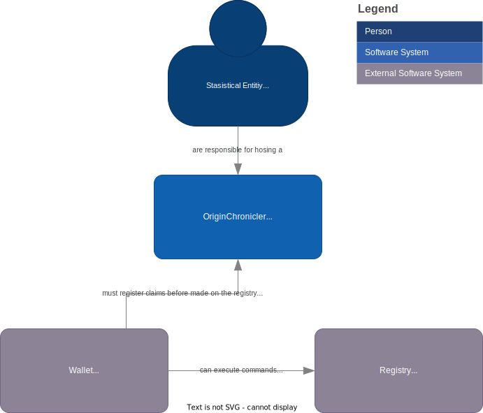
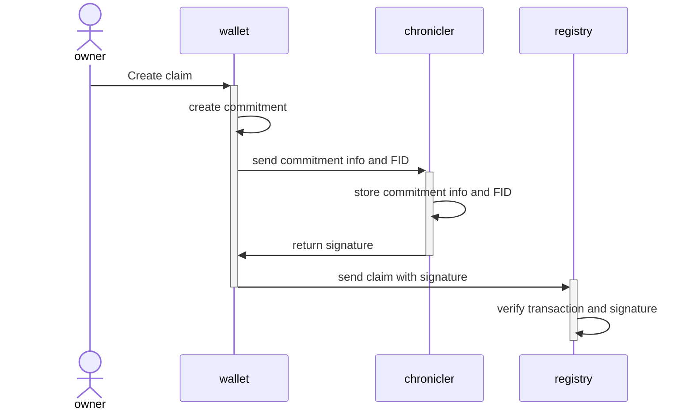

# OriginChronicler

OpenSource project to create a service which can record claims for a area based on the rules of the Project Origin.

## Problem Statement

In the Project-Origin all Granular Certificate data is "hidden" on the registries using homomorphic encryption (Pedersen commitments).

This ensures that all the data is kept private, and only the owner of a slice can prove the size of their slices and data to others.
This data is stored within the owners wallet.

The issuers would know how much has been issued and to whom.

But there is no way to know how much of the energy is claimed or not, and for statistics purposes this is needed.

## Context

Users might hold their assets in any wallet, and energy produced might be claimed against any consumption also in other areas.

The data is stored in the users wallet, but the data is not shared with the issuer or any other party.

## Forces

It is a requirement for a country to be able to know how much of the energy produced is claimed or not.

The data is stored in the users wallet, but the data is not shared with the issuer or any other party.

## Solution

The solution is to create a requirement for a claim to be co-signed by the chronicle service and the owner.
Basically the owner registers the claim with the chronicle service, and the chronicle service signs the claim before it is sent to registry.

The registry can then check the signature of the chronicle service to ensure that the claim has been registered.

The chronicle service will then be able to provide statistics on how much of the energy produced is claimed or not.

This requires an additional rule to be added to the Energy Tack & Trace rules.

## Sketch

Below is a C4 system diagram of an overview of the system landscape OriginChronicler is a part of.

## Suggested call flow

Below is a sequence diagram of the call flow between the wallet, chronicler and registry.

## Resulting Context

The statistical entity running the OriginChronicler is now able to provide statistics
on how much has been claimed within an area in a verifiable and trustable way without compromising the privacy of the users.

The registry never needs to know the data or call the chronicle service,
it only needs to verify the transactions as always, and verify the signature of the chronicle service that the claim has been registered.

The chronicle service now knows the size of each claim for the given area, but importantly it does not know the owner of the claim.
